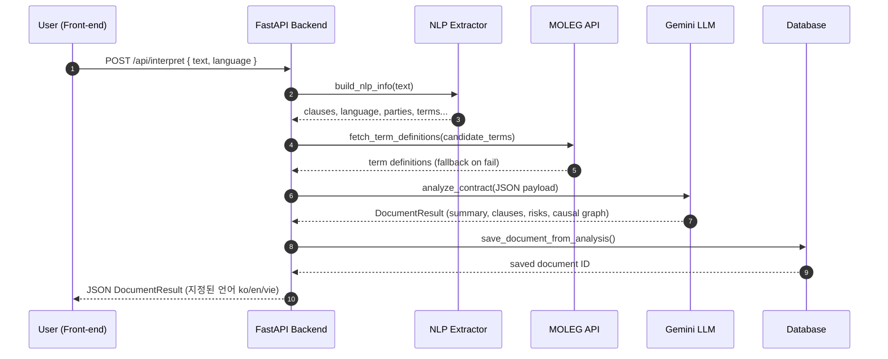
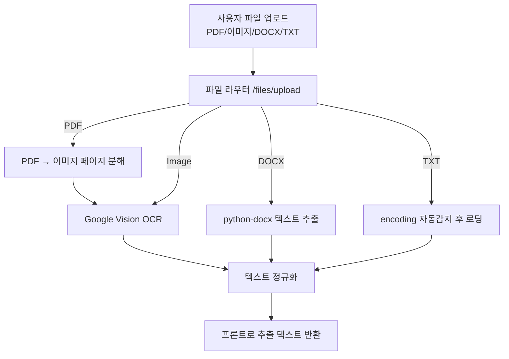
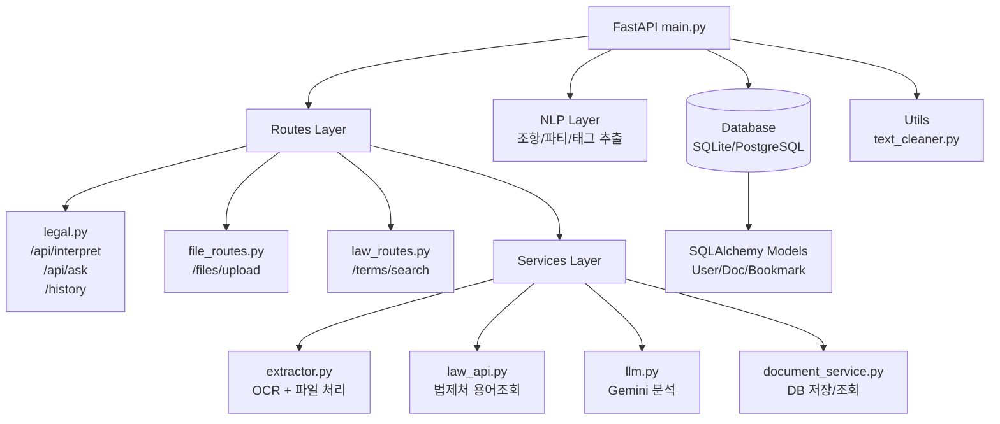

# ⚖️ Legal AI Backend  
FastAPI 기반 계약서/법률 문서 자동 분석 백엔드

본 백엔드는 계약서·법률 문서를 업로드하면  
**OCR → NLP 전처리 → 법제처 용어조회 → Gemini 기반 심층 분석 -> DB 저장**을 수행하는 법률 분석 백엔드 입니다.

계약서 요약, 조항별 분석, 리스크 진단, 인과관계 그래프, 다국어 설명 (ko/en/vie)까지 지원합니다.
---

# 1. 실행 방법

## 1) 프로젝트 루트(legal-ai)에서 가상환경 활성화
```bash
source venv/bin/activate
```
## 2) backend 폴더로 이동
```bash
cd backend
```
## 3) 서버 실행
```bash
uvicorn app.main:app --reload
```
## 4) API 문서 확인
```bash
Swagger UI
http://127.0.0.1:8000/docs
OpenAPI JSON
http://127.0.0.1:8000/openapi.json
```

# 2. 환경변수 (.env)
프로젝트 루트에 .env 파일 필요
```bash
GEMINI_API_KEY=YOUR_API_KEY_HERE
MOLEG_API_KEY=YOUR_API_KEY_HERE
GOOGLE_APPLICATION_CREDENTIALS=/path/to/google_vision.json

```

# 3. 주요 기능 요약
### 파일 처리 (app/services/extractor.py)
- PDF → 페이지별 이미지 변환 후 Google Vision OCR
- 이미지(PNG/JPG/JPEG) OCR
- DOCX 파싱
- TXT 인코딩 처리
- HWP는 PDF로 변환 안내
- MIME 타입 자동 판별

### NLP 전처리 (app/nlp/extractor.py)
- 조항 자동 분리(제1조 ~)
- 언어 감지(ko/en) 
- 도메인 태깅(근로/임대차/NDA/IT 등)
- 당사자 추출(근로자/사용자/임대인/임차인)
- 법률 용어 후보 자동 추출
- 불필요 공백/개행 정리

### 법제처 용어 정의 연동 (app/services/law_api.py)
- 병렬 요청(aiohttp)
- 한국어/영문 정의 자동 매핑
- 오류 발생 시 graceful fallback

### LLM 분석 (app/services/llm.py)
- Gemini 2.0 Flash Lite 사용
- JSON-only 출력 강제 프롬프트
- 조항별 요약/리스크/태그 생성
- 문서 전체 요약, 위험도 점수
- 인과관계(causal graph) 생성
- 출력 안정화 및 fallback 처리
- SHA256 기반 캐시로 중복 호출 방지

# 5. 폴더 구조
```bash
backend/
 ├── app/
 │   ├── main.py                # FastAPI app 초기화
 │   ├── routes/
 │   │     ├── legal.py         # 텍스트 분석, 질의응답, 북마크, 공유 기능
 │   │     ├── file_routes.py   # 파일 업로드/OCR
 │   │     ├── contract_routes.py # 계약서 API
 │   │     └── law_routes.py    # 법제처 용어 API
 │   ├── services/
 │   │     ├── extractor.py     # OCR + 파일 텍스트 추출
 │   │     ├── law_api.py       # 법제처 용어 조회
 │   │     ├── llm.py           # Gemini 분석 로직
 │   │     └── document_service.py # DB 저장 처리
 │   ├── nlp/
 │   │     └── extractor.py     # 조항/언어/용어 분리
 │   ├── db/
 │   │     ├── database.py      # DB 연결 (SQLite/Postgres)
 │   │     └── models.py        # User/Conversation/Bookmark 등 모델
 │   ├── models/
 │   │     └── legal.py         # Pydantic DocumentResult 구조
 │   └── utils/
 │         └── text_cleaner.py  # 공백 정리 등
 ├── venv/
 └── README.md
```
# 6. 흐름
## 1) 전체 처리


## 2) 파일 업로드 -> OCR -> 분석 흐름

## 3) 전체 백엔드 아키텍처 (Directory 구조 기반)

